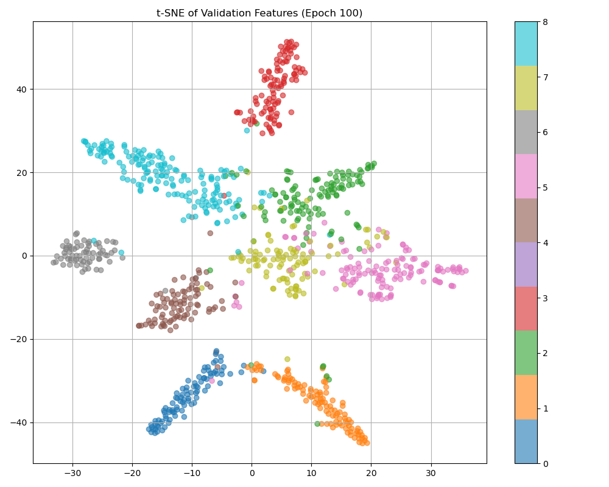
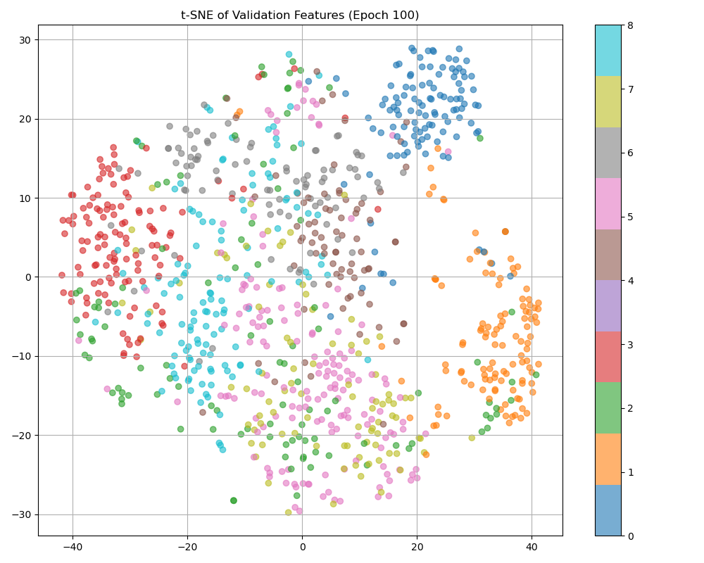

Here's a cleaner and more polished version of your GitHub README:

---

# SimCLR vs SupCon

## Exploring Unsupervised and Supervised Contrastive Learning with EfficientNet-B0 on PathMNIST

This repository provides a PyTorch-based reference implementation of two influential contrastive learning approaches, applied to the [PathMNIST](https://medmnist.com/) dataset:

* [Supervised Contrastive Learning](https://arxiv.org/abs/2004.11362) (SupCon)
* [SimCLR: A Simple Framework for Contrastive Learning](https://arxiv.org/abs/2002.05709)

---

## 📊 Results

| Method        | Setting      | Loss Function | Validation Accuracy (%) | Test Accuracy (%) |
| ------------- | ------------ | ------------- | ----------------------- | ----------------- |
| Cross-Entropy | Supervised   | Cross Entropy | 96.54                   | 78.34             |
| SupContrast   | Supervised   | Contrastive   | 97.03                   | 90.24             |
| SimCLR        | Unsupervised | Contrastive   | 78.72                   | 79.64             |

---

## ⚙️ Installation

### 1. Create Conda Environment

```bash
conda create --name myenv python=3.10 -y
conda activate myenv
```

### 2. Install Dependencies

```bash
conda install -y numpy matplotlib scikit-learn
pip install \
  torch torchvision torchaudio --index-url https://download.pytorch.org/whl/cu118 \
  tensorboard_logger \
  tensorflow \
  medmnist
```

---

## 🚀 Running the Experiments

> ⚠️ Set `--num_workers 0` if encountering issues with multiprocessing.

### (1) Standard Cross-Entropy

```bash
python main_ce.py
```

### (2) Supervised Contrastive Learning (SupCon)

**Pretraining:**

```bash
python main_supcon.py --method SupCon
```

**Linear Classifier Training:**

```bash
python linear.py --ckpt /path/to/last.pth
```

**Evaluation:**

```bash
python main_supcon-linear_test.py --model_path /path/to/best.pth
```

### (3) SimCLR

**Pretraining:**

```bash
python main_supcon.py --method SimCLR
```

**Linear Classifier Training & Evaluation:**

```bash
python linear.py --ckpt /path/to/last.pth
```

**Evaluation:**

```bash
python main_simclr-linear_test.py --model_path /path/to/best.pth
```

---

## 🧠 t-SNE Visualizations

### SupCon (Supervised)

<p align="center">
  
</p>

### SimCLR (Unsupervised)

<p align="center">
  
</p>

---

## 📦 Pretrained Models

Download pretrained models and place them in the `.save/SupCon` directory:

[📁 Google Drive Folder](https://drive.google.com/drive/folders/1FFh6QCRfdOnLeKpsrESCcsmgurr39ldW?usp=sharing)

---

## 📄 License

This project includes modified code from [Yonglong Tian’s SupContrast repository](https://github.com/HobbitLong/SupContrast), licensed under the BSD 2-Clause License.

See the [LICENSE](./LICENSE) file for full details.
